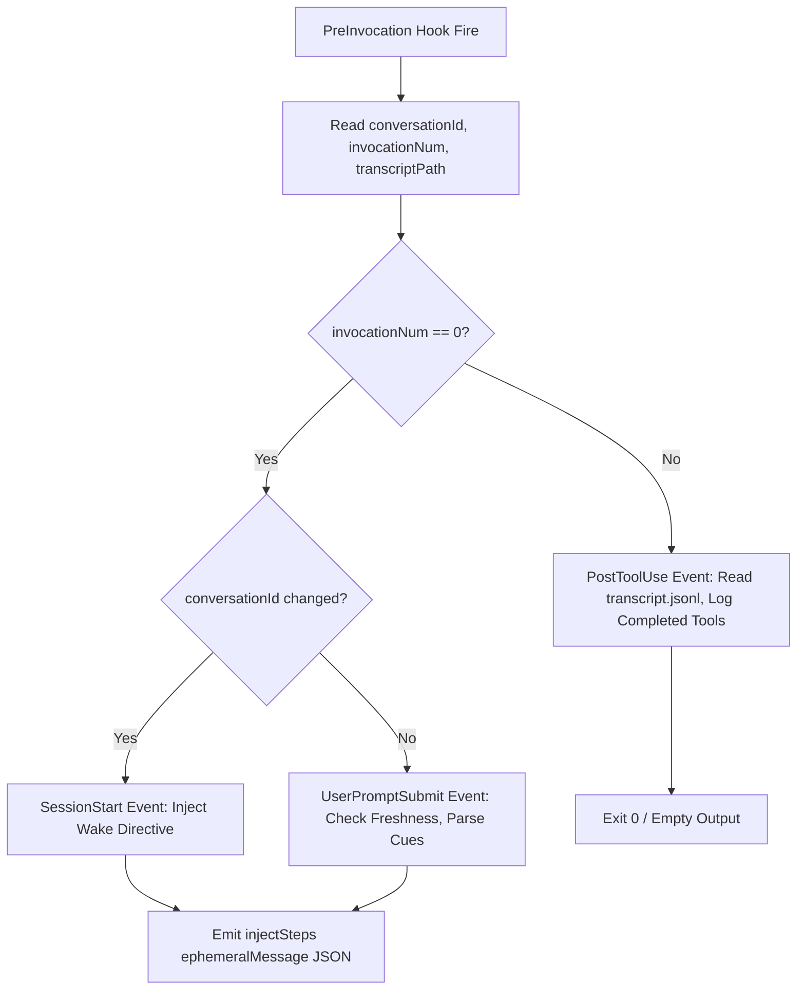

# AsOf — Google Antigravity install guide

This guide covers installing and configuring the **AsOf** temporal-awareness skill adapter for the Google Antigravity substrate.

## Quick install

Run the installer script from the root of the Antigravity adapter directory:

```powershell
python install.py
```

This installer automatically:
1. Detects or creates the config directories:
   - `~/.gemini/config/hooks/asof/`
   - `~/.gemini/config/plugins/asof/`
2. Copies `asof_antigravity_orchestrator.py` to the hook folder.
3. Copies `SKILL.md` to the plugins folder.
4. Updates `~/.gemini/config/hooks.json` idempotently to wire up the single `PreInvocation` hook.

Restart your Antigravity session to apply the changes.

---

## Manual install

If you prefer to configure the adapter manually, follow these steps:

### 1. Create target directories

Create the folders for hook scripts and plugin teaching prose:

```powershell
mkdir -Force "$env:USERPROFILE\.gemini\config\hooks\asof"
mkdir -Force "$env:USERPROFILE\.gemini\config\plugins\asof"
```

### 2. Copy the files

Copy the orchestrator script and the model instruction file (`SKILL.md`):

```powershell
Copy-Item -Path "adapters\antigravity\asof_antigravity_orchestrator.py" -Destination "$env:USERPROFILE\.gemini\config\hooks\asof\asof_antigravity_orchestrator.py"
Copy-Item -Path "adapters\antigravity\SKILL.md" -Destination "$env:USERPROFILE\.gemini\config\plugins\asof\SKILL.md"
```

Ensure the orchestrator has execution permissions (for Unix/macOS environments, though not strictly required on Windows):
```bash
chmod +x ~/.gemini/config/hooks/asof/asof_antigravity_orchestrator.py
```

### 3. Patch hooks.json

Create or open the hook configuration file at `~/.gemini/config/hooks.json` and merge the following block under the `"current"` agent:

```json
{
  "current": {
    "PreInvocation": [
      {
        "type": "command",
        "command": "python ~/.gemini/config/hooks/asof/asof_antigravity_orchestrator.py",
        "timeout": 5
      }
    ]
  }
}
```

Ensure that backslashes in paths are either avoided or written with forward slashes (e.g. `C:/Users/.../.gemini/config/hooks/asof/...`) to prevent escaping errors.

---

## Event Synthesis Architecture

Unlike reference platforms like Claude Code, which natively expose distinct events for `SessionStart`, `UserPromptSubmit`, and `PostToolUse`, Antigravity exposes only a single `PreInvocation` event that triggers on every executor step. 

To prevent redundant injections and high token-burn overhead, the Antigravity adapter uses a lightweight event synthesis model:



### 1. SessionStart (Wake)
* **Trigger**: A change in the active `conversationId` since the last invocation.
* **Mechanism**: State is tracked inside `~/.asof/state/session_state.json`. On detecting a new ID, a wake event is raised, prepending training cutoff statistics, weekday information, and calendar context, followed by the core time-decay grounding directive.

### 2. UserPromptSubmit
* **Trigger**: `invocationNum == 0` on subsequent turns of an active session.
* **Mechanism**: The user's input is read from the `transcript.jsonl` logs. The orchestrator checks matching files in the workspace for modified-time shifts, and scans the input for time-sensitive phrasing (Tiers 1 & 2), outputting stale alerts as context injections.

### 3. PostToolUse
* **Trigger**: `invocationNum > 0` (indicating subsequent steps of the multi-step agent loop).
* **Mechanism**: Since tools execute and write results between executor steps, the orchestrator reads the newly appended steps in `transcript.jsonl` from the path provided in `transcriptPath`. Any completed file reads, writes, command runs, or web searches are extracted, categorized by volatility, and logged to `~/.asof/tool_log/<conv_id>.jsonl` for subsequent freshness checks.

---

## Verification and Testing

To verify the setup:

1. **Verify State Creation**: Start a new chat session. `~/.asof/state/session_state.json` should be initialized and contain the current `conversationId`.
2. **Verify Tool Logging**: Call a command that reads a file (e.g. `view_file`). Check `~/.asof/tool_log/<conversationId>.jsonl` to ensure the tool call was logged.
3. **Verify Freshness Alerts**: Modify that file externally (e.g., using notepad or a shell command) and send another user message. The orchestrator will inject a `STALE` alert warning you about the changed file before the model executes your command.
